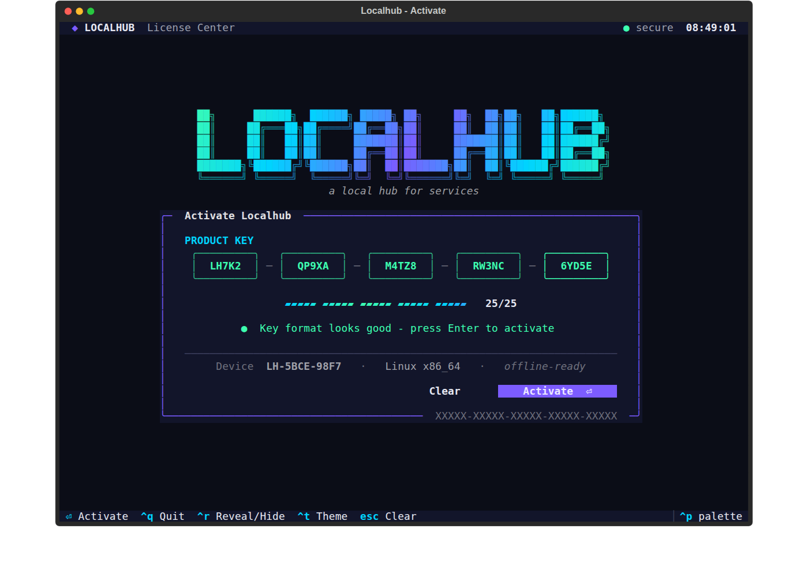
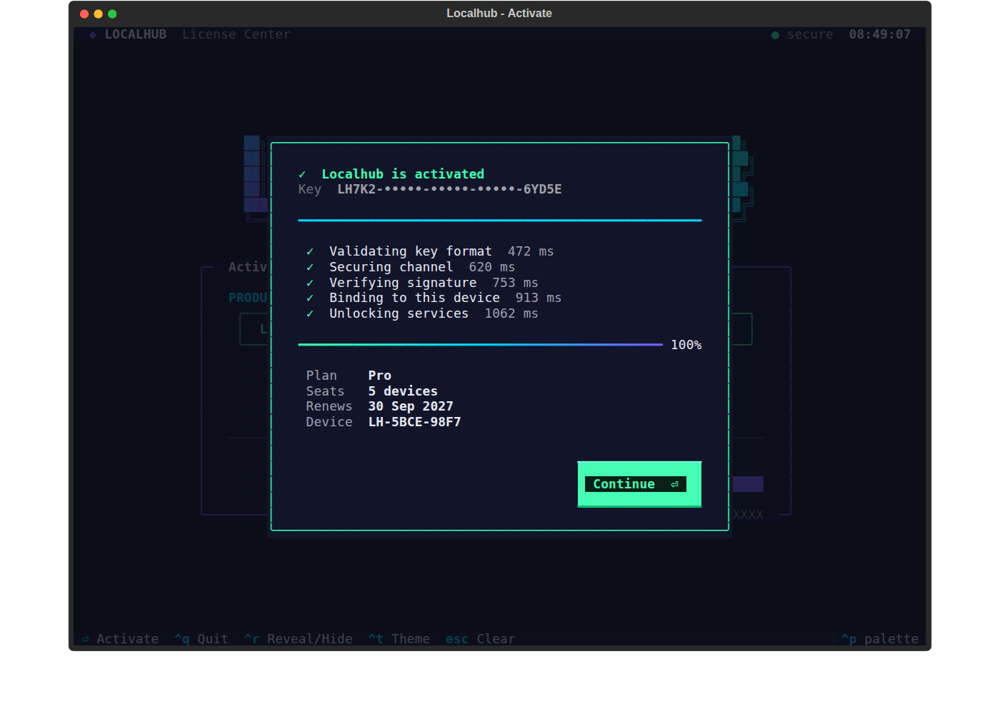

# Localhub
a Local hub for services
ig
## Key activation menu (terminal UI)

A license-key activation screen for the terminal, built with [Textual](https://textual.textualize.io/).

```bash
pip install -r requirements.txt
python -m keymenu
```

- Five auto-advancing key blocks. Letters are uppercased as you type, Backspace moves back across blocks, and a pasted key is split across the blocks.
- A live fill meter, status hints, and a shake plus red highlight when the key is incomplete.
- An activation dialog that shows each step with a spinner and its timing, a progress bar, and a success or failure view.
- A gradient logo, a clock in the top bar, a footer listing the key bindings, and a layout that adapts to narrow terminals.
- Keys: `Enter` activate · `Esc` clear · `Ctrl+R` show or hide the key · `Ctrl+T` change theme · `Ctrl+P` command palette · `Ctrl+Q` quit.

This is the interface only. The key check is a stub: replace `verify_key()` in `keymenu/app.py` with the real call. In the demo, any key ending in `00000` is rejected so you can see the failure screen. `KeyMenuApp().run()` returns the activated key, or `None` if the user quit.



